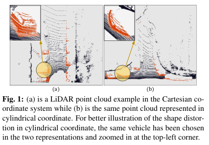
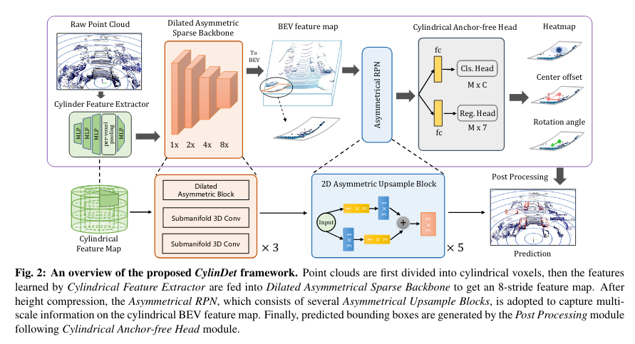

# CylinDet

3D Object Detection in the cylindrical bird-eye view.

<!-- 
  
 -->

  

> [**CylinDet: LiDAR-based 3D Object Detection under Cylindrical Representation**]()      

  
           
This repo is the original implementation of CylinDet on the KITTI dataset. Pretrained models are coming soon. 

## Acknowledgement
Our code is based on [OpenPCDet](https://github.com/open-mmlab/OpenPCDet). 
Thanks OpenPCDet Team for their awesome codebases.
